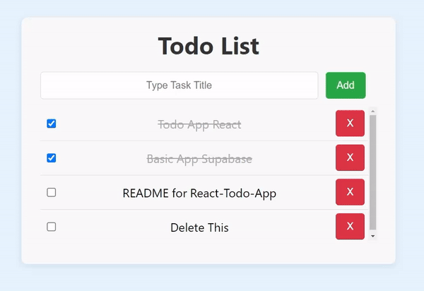
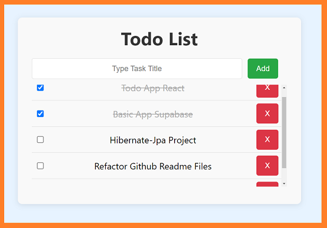
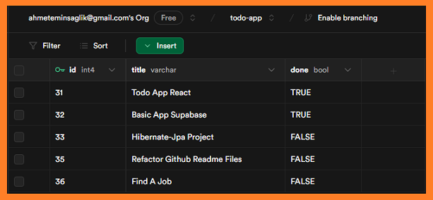

# <i>React Todo App  (with Supabase) </i>



## Content
<ol>
        <a href="#about-project"><li>About The Project</li></a>
        <a href="#why-project-created"><li>Why The Project Is Created?</li></a>
        <a href="#used-technologies"><li>Used Technologies</li></a>
        <a href="#image"><li>Images </li></a>
        <a href="#requirements"><li>Requirements</li></a>   
        <a href="#installation"><li>Installation</li></a>

<!--         <a href="#version-difference"><li>Version Difference</li></a> -->

</ol>

## <span id="about-project">1-) About The Project</span>

***React Todo App*** is a basic to-do app. Tasks can be created, read, updated, and deleted, for backend supabase is used. 

## <span id="why-project-created">2-) Why The Project Is Created?</span >
This project was created as a basic project using [supabase](https://supabase.com/) technology. 

## <span id="used-technologies">3-) Used Technologies</span>

* Core Technologies:
    - React
    - Supabase
    - [Vite](https://vitejs.dev/)
* Dependencies
    - @supabase/supabase-js: This is for interacting with Supabase.
    - @supabase/react: This is for using Supabase in React applications.

## <span id="image">4-) Images </span>

- Screenshot from the app. <br>


<br><br>

- Screenshot from Supabase Table.<br><br>



## <span id="requirements">5-) Requirements</span>

- Node.js: +14  (worked on: 20.15.0)
- npm: +6  (worked on: 10.7.0)
- **Visual Studio Code**: [Download](https://code.visualstudio.com/)

## <span id="installation">6-) Installation </span>

1. Copy and paste the following command into your terminal.

```git
git clone https://github.com/AhmetEminSaglik/React-Todo-App.git
```
2.  Update your Supabase login credentials. You can find them in `React-Todo-App\src\App.jsx` 
 
 ```react
 const supabase = createClient(
  "YOUR_SUPABASE_PROJECT_URL",
  "YOUR_SUPABASE_PROJECT_API_KEYS"
);

 ```

3.  After completing step 2, you can run the following commands step by step in the terminal to launch the React-Todo-App.

```
 cd React-Todo-App
 npm install
 npm run dev
```

